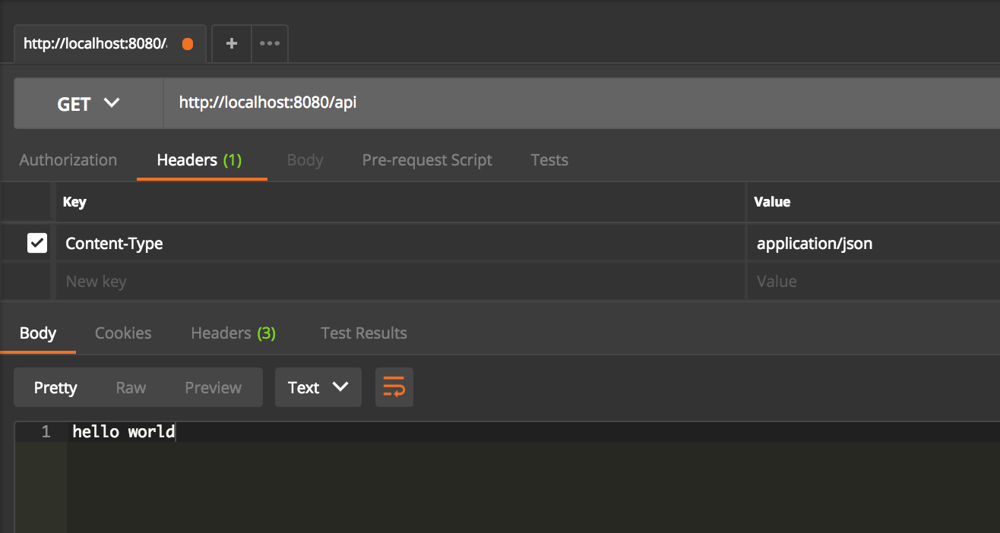

# Demo paso a paso

Este documento prentende ser una guia rápida para poder armar una api rest con spring boot y jpa/hibernate en pocos pasos.


## Requisistos

Para poder armar el proyecto sera necesario tener instalado [java 8](http://www.oracle.com/technetwork/java/javase/downloads/jre8-downloads-2133155.html) y [maven](https://maven.apache.org/install.html). 
También es recomendable contar con algún [ide](https://www.jetbrains.com/idea/) que facilite la tarea del desarrollo.

## Pasos

### Set up del proyecto

Primero vamos a armar la estructura general del proyecto. En este caso, vamos a usar la herramienta [spring initializr](https://start.spring.io/) que nos permite seleccionar las dependencias que necesitamos para armar una pequeña api rest que se conecta con una base de datos. 


En este caso, las dependencias que vamos a agregar son: 

- **Web:** Un starter de spring boot que nos agrega las librerias necesarias para poder desarrollar nuestra api rest. Nos ayuda en la definición de controllers, el mapeo de parametros entre la request HTTP y la definición de nuestros métodos, herramientas de loggin, etc..
Se termina traduciendo en las siguientes lineas dentro de nuestro pom.xml:
```xml
    <dependency>
        <groupId>org.springframework.boot</groupId>
        <artifactId>spring-boot-starter-web</artifactId>
        <version>2.0.1.RELEASE</version>
    </dependency>
```

- **Jpa:** Al igual que la dependencia anterior, este starter de spring boot que nos agrega las librerias necesarias para poder hacer un mapeo entre nuestro modelo de objetos y un esquema de base de datos relacional.
Se termina traduciendo en las siguientes lineas dentro de nuestro pom.xml:
```xml
    <dependency>
        <groupId>org.springframework.boot</groupId>
        <artifactId>spring-boot-starter-data-jpa</artifactId>
        <version>2.0.1.RELEASE</version>
    </dependency>
```

- **H2:** Esta dependencia nos evita tener que hacer la instalación/configuración de un RDBMs. 
Se termina traduciendo en esta dependencia dentro del pom.xml: 
```xml
    <dependency>
        <groupId>com.h2database</groupId>
        <artifactId>h2</artifactId>
        <scope>runtime</scope>
    </dependency>
```
Quien cuente con un mysql ya instalado, puede cambiar esta dependencia de H2 por la de Mysql (Mysql jdbc driver), para poder manejar la conexión entre nuestra aplicación y la base de datos. Esto nos va a permitir ver luego de que manera hibernate hace el mapeo al esquema de la bas de datos.

El archivo que nos genera esta página es un demo.zip que contiene toda la estructura básica inicial del proyecto. Podemos correr los siguientes comandos para verificar que todo este bien:

```bash
unzip demo.zip
cd demo
mvn compile
```

El resultado debería ser algo similar a esto:


### Hello world controller

Nuestro siguiente paso es armar un controller básico que nos permita testear los controllers que genera spring. Para esto primero importamos el proyecto (en el caso del intelliJ debería ser tan fácil como File > Open...).
El proyecto contiene estos archivos:


Creamos una nueva clase que será nuestro controller. Luego, solamente es necesario anotarla con la annotation `@RestController` para que spring la detecte como un controller de nuestra aplicación.
Si ademas queremos mapear esta clase a otra ruta, como por ejemplo '/api', deberíamos agregar la annotation `@RequestMapping`: 

```java 
import org.springframework.web.bind.annotation.RequestMapping;
import org.springframework.web.bind.annotation.RestController;

@RestController
@RequestMapping("/api")
public class HelloWorldController {

}
```

Ahora definimos un método que se encargué de manejar las request http con verbo GET, y devuelva un string con la palabra "hola mundo". Para esto solamente es necesario anotar al metodo con `@GetMapping`:
```java 
@GetMapping
public String helloWorldEndpoint() {
    return "hello world";
}
 ```
 
Creamos una configuración para poder levantar nuestra api desde la opción de 'Edit Configuration':


Ahora levantamos la aplicación y probamos nuestro endpoint:
 
 
 
 
 
 
### Jpa & Hibernate

El siguiente paso es armar algún modelo en nuestro dominio y mapearlo a nuestra base de datos. Para este ejemplo vamos a crear la clase Customer, y agregarle algunas propiedades:
```java 

import javax.persistence.Entity;
import javax.persistence.GeneratedValue;
import javax.persistence.GenerationType;
import javax.persistence.Id;

@Entity
public class Customer {

    @Id
    @GeneratedValue(strategy=GenerationType.AUTO)
    private Long id;
    private String firstName;
    private String lastName;

    protected Customer() {}

    public Customer(String firstName, String lastName) {
        this.firstName = firstName;
        this.lastName = lastName;
    }

    @Override
    public String toString() {
        return String.format(
                "Customer[id=%d, firstName='%s', lastName='%s']",
                id, firstName, lastName);
    }

}
 ```
 
 En este fragmento de código tenemos las siguientes annotations:
 - **@Entity:** Con esto le estamos indicando a hibernate que esta clase debe mapearse con alguna tabla de nuestro esquema.
 - **@Id:** Le indicamos que el atributo será quien contenga el id que lo identifica.
 - **@GeneratedValue:** Genera automáticamente un id cuando se está insertando una nueva instancia.
 
 Lo siguiente es definir un repositorio que nos permita realizar operaciones sobre esta entidad. Para esto contamos con los `CrudRepository`. CrudRepository es una interfaz que nos provee spring con las operaciones básicas (crud) para operar sobre nuestro dominio.
 
 Al levantar nuestra aplicación spring detecta que tenemos esta interfaz, e implementa los métodos necesarios para que funcione. Además, podemos crear nuevos métodos que sirvan para hacer queries sobre nuestra base de datos. Por ejemplo, si necesitamos buscar `Customer`'s por la propiedad lastName, podemos definir el método `List<Customer> findByLastName(String lastName)` y spring se encarga de implementarlo:
 
 ```java
import java.util.List;
import org.springframework.data.repository.CrudRepository;

public interface CustomerRepository extends CrudRepository<Customer, Long> {

    List<Customer> findByLastName(String lastName);

} 
  ```
  
